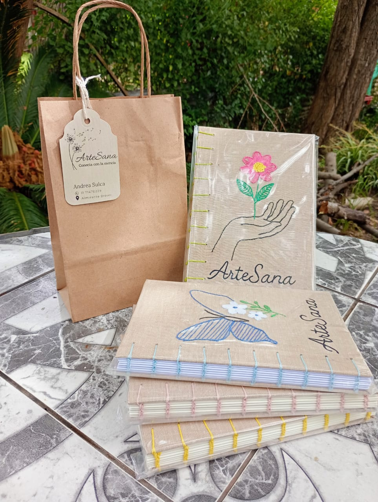

# Artesana - El Alma en Cada Detalle



**Artesana** es una tienda online para exhibir cuadernos y bordados artesanales. Inspirado en marcas de primer nivel como Apple y Adidas, este proyecto se enfoca en ofrecer una experiencia de usuario premium, limpia y elegante, manteniendo al mismo tiempo una estética natural y terrenal que refleja el alma de la artesanía.

## ✨ Características

- **Diseño Elegante y Responsivo:** Una interfaz completamente adaptable que luce increíble en todos los dispositivos, desde computadoras de escritorio hasta teléfonos móviles.
- **Animaciones Dinámicas:** Animaciones sutiles y fluidas con `framer-motion` para crear una experiencia de usuario viva y atractiva.
- **Catálogo de Productos:** Páginas de productos bellamente diseñadas, incluyendo un listado principal y vistas detalladas para cada creación.
- **Integración con Instagram:** Un carrusel dinámico que muestra las últimas publicaciones del feed de Instagram de la marca, manteniendo el contenido fresco y conectado.
- **UI Interactiva:** Atractivos efectos de hover en las tarjetas de producto y elementos interactivos que mejoran la navegación del usuario.
- **Recomendaciones Potenciadas por IA:** Construido con una base en Genkit para proporcionar recomendaciones de productos impulsadas por IA basadas en el comportamiento del usuario (flujo ya implementado).
- **Canales de Contacto Directo:** Una sección de contacto optimizada que dirige a los usuarios a WhatsApp, Instagram y correo electrónico para una comunicación fácil.

## 🛠️ Stack Tecnológico

Este proyecto está construido con un stack tecnológico moderno y potente:

- **Framework:** [Next.js](https://nextjs.org/) (App Router)
- **Lenguaje:** [TypeScript](https://www.typescriptlang.org/)
- **Estilos:** [Tailwind CSS](https://tailwindcss.com/)
- **Componentes UI:** [ShadCN UI](https://ui.shadcn.com/)
- **Animaciones:** [Framer Motion](https://www.framer.com/motion/)
- **Integración IA:** [Genkit (Firebase AI)](https://firebase.google.com/docs/genkit)
- **Despliegue:** Firebase App Hosting

## 🚀 Cómo Empezar

Para obtener una copia local y ponerla en marcha, sigue estos sencillos pasos.

### Prerrequisitos

- Node.js (v20 o superior)
- npm

### Instalación

1.  Clona el repositorio
    ```sh
    git clone https://github.com/tu_usuario/tu_repositorio.git
    ```
2.  Instala los paquetes NPM
    ```sh
    npm install
    ```
3.  Ejecuta el servidor de desarrollo
    ```sh
    npm run dev
    ```
    Abre [http://localhost:9002](http://localhost:9002) para verlo en el navegador.

## 📂 Estructura del Proyecto

El proyecto está organizado siguiendo las convenciones del App Router de Next.js:

- `src/app/`: Contiene todas las rutas y páginas de la aplicación.
- `src/components/`: Componentes de React reutilizables, incluyendo elementos de UI de ShadCN y componentes personalizados.
- `src/lib/`: Funciones de utilidad, datos de productos y lógica compartida.
- `src/ai/`: Contiene los flujos de Genkit para las características impulsadas por IA.
- `public/`: Activos estáticos como imágenes y logotipos.
- `tailwind.config.ts`: Archivo de configuración para Tailwind CSS.

